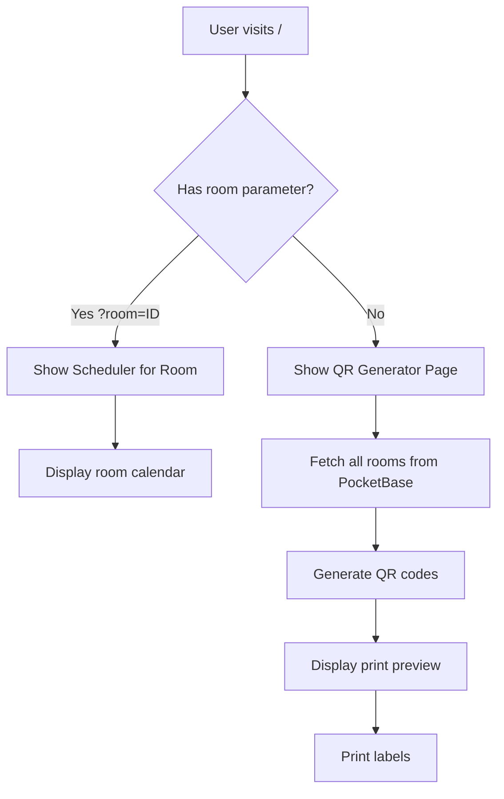

# QR Code Generator & Print Plan

## Overview

A dual-mode page that serves two purposes:
- **Root URL** (`/`) → QR code generator with print preview (for admins)
- **Room URL** (`/?room=ROOM_ID`) → Meeting scheduler for that room (for users)

---

## URL Structure

```
┌─────────────────────────────────────────────────────────────┐
│  Root URL                                                    │
│  https://scheduler.afed.com/                                │
│                                                              │
│  ┌──────────────────────────────────────────────────────┐  │
│  │  QR Code Generator & Print Preview                    │  │
│  │                                                       │  │
│  │  [Room: Operation 133 ▼] [Generate QR] [Print All]   │  │
│  │                                                       │  │
│  │  ┌──────────┐ ┌──────────┐ ┌──────────┐              │  │
│  │  │   QR     │ │   QR     │ │   QR     │              │  │
│  │  │  Code    │ │  Code    │ │  Code    │              │  │
│  │  │          │ │          │ │          │              │  │
│  │  │ Op. 133  │ │  Mtg A   │ │  Hall    │              │  │
│  │  └──────────┘ └──────────┘ └──────────┘              │  │
│  │                                                       │  │
│  │  Print Preview: ○ A4  ○ Letter  ● 2x4 Grid          │  │
│  └──────────────────────────────────────────────────────┘  │
└─────────────────────────────────────────────────────────────┘

┌─────────────────────────────────────────────────────────────┐
│  Room URL                                                    │
│  https://scheduler.afed.com/?room=ROOM_ID                   │
│                                                              │
│  ┌──────────────────────────────────────────────────────┐  │
│  │  AFED Scheduler - Operation 133                      │  │
│  │                                                       │  │
│  │  [3D Model Viewer]                                   │  │
│  │  [Calendar]                                          │  │
│  │  [Book Button]                                       │  │
│  └──────────────────────────────────────────────────────┘  │
└─────────────────────────────────────────────────────────────┘
```

---

## Page Logic Flow



---

## Page Components

### 1. Root Page (`/`) - QR Generator Mode

#### Layout Structure

```
┌─────────────────────────────────────────────────────────┐
│  Header: QR Code Generator                              │
│                                                         │
│  Controls:                                              │
│  ┌──────────────────────────────────────────────────┐  │
│  │  Paper Size: [A4 ▼]  Layout: [2x3 Grid ▼]       │  │
│  │  [Generate QRs] [Print All] [Download PDF]      │  │
│  └──────────────────────────────────────────────────┘  │
│                                                         │
│  Print Preview:                                         │
│  ┌──────────────────────────────────────────────────┐  │
│  │  ┌─────────┐  ┌─────────┐                        │  │
│  │  │   QR    │  │   QR    │                        │  │
│  │  │  Code   │  │  Code   │                        │  │
│  │  │         │  │         │                        │  │
│  │  │ Room A  │  │ Room B  │                        │  │
│  │  └─────────┘  └─────────┘                        │  │
│  │                                                   │  │
│  │  ┌─────────┐  ┌─────────┐                        │  │
│  │  │   QR    │  │   QR    │                        │  │
│  │  │  Code   │  │  Code   │                        │  │
│  │  │         │  │         │                        │  │
│  │  │ Room C  │  │ Room D  │                        │  │
│  │  └─────────┘  └─────────┘                        │  │
│  └──────────────────────────────────────────────────┘  │
└─────────────────────────────────────────────────────────┘
```

#### Component Structure

```tsx
// app/page.tsx (root page)
export default function Home() {
  const searchParams = useSearchParams();
  const roomId = searchParams.get('room');

  // If room parameter exists, show scheduler
  if (roomId) {
    return <SchedulerPage roomId={roomId} />;
  }

  // Otherwise, show QR generator
  return <QRGeneratorPage />;
}

// QR Generator Page
function QRGeneratorPage() {
  const [rooms, setRooms] = useState<PbRoom[]>([]);
  const [paperSize, setPaperSize] = useState<'a4' | 'letter'>('a4');
  const [layout, setLayout] = useState<'2x2' | '2x3' | '3x3'>('2x3');
  const [qrCodes, setQrCodes] = useState<Map<string, string>>(new Map());

  return (
    <main className="qr-generator-page">
      <Header title="QR Code Generator" />

      <Controls>
        <PaperSizeSelector value={paperSize} onChange={setPaperSize} />
        <LayoutSelector value={layout} onChange={setLayout} />
        <PrintButton onClick={handlePrint} />
        <DownloadPDFButton onClick={handleDownloadPDF} />
      </Controls>

      <PrintPreview paperSize={paperSize} layout={layout}>
        {rooms.map(room => (
          <QRLabel key={room.id} room={room} qrCode={qrCodes.get(room.id)} />
        ))}
      </PrintPreview>
    </main>
  );
}
```

---

### 2. QR Label Component

Each QR label contains:

```
┌────────────────────────────────────┐
│                                    │
│        AFED MEETING ROOM           │  ← Brand Header
│                                    │
│    ┌──────────────────────┐        │
│    │                      │        │
│    │     [QR CODE]        │        │  ← QR Code (300x300px)
│    │                      │        │       Color: #481267
│    │                      │        │
│    └──────────────────────┘        │
│                                    │
│        Operation 133               │  ← Room Name (Large)
│       (Floor 1)                    │  ← Floor Level (Optional)
│                                    │
│   ─────────────────────────────    │  ← Divider
│                                    │
│   Scan to view schedule & book     │  ← Instructions
│                                    │
│   scheduler.afed.com/?room=abc123  │  ← Full URL
│                                    │
└────────────────────────────────────┘
```

#### Component Props

```tsx
interface QRLabelProps {
  room: PbRoom;
  qrCode: string; // Data URL or SVG
  paperSize?: 'a4' | 'letter';
}

function QRLabel({ room, qrCode }: QRLabelProps) {
  const roomUrl = `${window.location.origin}/?room=${room.id}`;

  return (
    <div className="qr-label">
      <div className="qr-header">
        <Logo />
        <h2>AFED MEETING ROOM</h2>
      </div>

      <div className="qr-code">
        
      </div>

      <h1 className="room-name">{room.name}</h1>
      {room.floorLevel && (
        <p className="room-floor">Floor {room.floorLevel}</p>
      )}

      <hr className="qr-divider" />

      <p className="qr-instructions">
        Scan to view schedule & book
      </p>

      <p className="qr-url">{roomUrl}</p>
    </div>
  );
}
```

---

## Print Layout Options

### Option 1: 2x2 Grid (4 labels per sheet)

```
┌─────────────────────────────────────────────────────────┐
│  ┌──────────────┐  ┌──────────────┐                   │
│  │              │  │              │                   │
│  │    QR 1      │  │    QR 2      │                   │
│  │              │  │              │                   │
│  └──────────────┘  └──────────────┘                   │
│                                                         │
│  ┌──────────────┐  ┌──────────────┐                   │
│  │              │  │              │                   │
│  │    QR 3      │  │    QR 4      │                   │
│  │              │  │              │                   │
│  └──────────────┘  └──────────────┘                   │
└─────────────────────────────────────────────────────────┘
```

**Label Size:** ~95×140mm each

### Option 2: 2x3 Grid (6 labels per sheet)

```
┌─────────────────────────────────────────────────────────┐
│  ┌──────────┐  ┌──────────┐                           │
│  │   QR 1   │  │   QR 2   │                           │
│  └──────────┘  └──────────┘                           │
│  ┌──────────┐  ┌──────────┐                           │
│  │   QR 3   │  │   QR 4   │                           │
│  └──────────┘  └──────────┘                           │
│  ┌──────────┐  ┌──────────┐                           │
│  │   QR 5   │  │   QR 6   │                           │
│  └──────────┘  └──────────┘                           │
└─────────────────────────────────────────────────────────┘
```

**Label Size:** ~95×90mm each

### Option 3: 3x3 Grid (9 labels per sheet)

```
┌─────────────────────────────────────────────────────────┐
│  ┌────────┐ ┌────────┐ ┌────────┐                      │
│  │  QR 1  │ │  QR 2  │ │  QR 3  │                      │
│  └────────┘ └────────┘ └────────┘                      │
│  ┌────────┐ ┌────────┐ ┌────────┐                      │
│  │  QR 4  │ │  QR 5  │ │  QR 6  │                      │
│  └────────┘ └────────┘ └────────┘                      │
│  ┌────────┐ ┌────────┐ ┌────────┐                      │
│  │  QR 7  │ │  QR 8  │ │  QR 9  │                      │
│  └────────┘ └────────┘ └────────┘                      │
└─────────────────────────────────────────────────────────┘
```

**Label Size:** ~60×90mm each

---

## CSS for Print Styles

```css
/* globals.css - Print styles */

@media print {
  /* Hide UI elements when printing */
  .no-print {
    display: none !important;
  }

  /* Page setup */
  @page {
    size: A4;
    margin: 10mm;
  }

  body {
    background: white !important;
  }

  /* Print layout grid */
  .qr-labels-grid {
    display: grid;
    gap: 10mm;
    width: 100%;
  }

  .qr-labels-grid[data-layout="2x2"] {
    grid-template-columns: repeat(2, 1fr);
    grid-template-rows: repeat(2, 1fr);
  }

  .qr-labels-grid[data-layout="2x3"] {
    grid-template-columns: repeat(2, 1fr);
    grid-template-rows: repeat(3, 1fr);
  }

  .qr-labels-grid[data-layout="3x3"] {
    grid-template-columns: repeat(3, 1fr);
    grid-template-rows: repeat(3, 1fr);
  }

  /* Individual label */
  .qr-label {
    border: 2px solid #481267;
    padding: 10mm;
    text-align: center;
    page-break-inside: avoid;
    box-sizing: border-box;
  }

  /* Ensure QR code is visible */
  .qr-code img {
    width: 60mm !important;
    height: 60mm !important;
  }

  /* Force background colors */
  * {
    -webkit-print-color-adjust: exact !important;
    print-color-adjust: exact !important;
  }

  /* Hide shadows */
  * {
    box-shadow: none !important;
  }
}
```

---

## QR Code Generation

### Method 1: Client-side with `qrcode` library

```bash
npm install qrcode
```

```tsx
import QRCode from 'qrcode';

async function generateQRCodes(rooms: PbRoom[]): Promise<Map<string, string>> {
  const qrMap = new Map<string, string>();

  for (const room of rooms) {
    const url = `${window.location.origin}/?room=${room.id}`;

    const dataUrl = await QRCode.toDataURL(url, {
      width: 512,
      margin: 2,
      color: {
        dark: '#481267',   // Brand purple
        light: '#FFFFFF'
      },
      errorCorrectionLevel: 'M' // Medium error correction
    });

    qrMap.set(room.id, dataUrl);
  }

  return qrMap;
}
```

### Method 2: QR Server API (No library needed)

```tsx
async function generateQRCodes(rooms: PbRoom[]): Promise<Map<string, string>> {
  const qrMap = new Map<string, string>();

  for (const room of rooms) {
    const url = encodeURIComponent(
      `${window.location.origin}/?room=${room.id}`
    );

    const apiUrl = `https://api.qrserver.com/v1/create-qr-code/?size=512x512&color=481267&bgcolor=FFFFFF&data=${url}`;

    // Use the API URL directly as img src
    qrMap.set(room.id, apiUrl);
  }

  return qrMap;
}
```

---

## Print Functionality

### Browser Print

```tsx
function handlePrint() {
  window.print();
}

// Triggered by Print button
<button onClick={handlePrint} className="btn-primary">
  <PrintIcon /> Print Labels
</button>
```

### PDF Generation (Optional)

```bash
npm install html2canvas jspdf
```

```tsx
import html2canvas from 'html2canvas';
import jsPDF from 'jspdf';

async function handleDownloadPDF() {
  const element = document.getElementById('qr-labels-grid');
  const canvas = await html2canvas(element, { scale: 2 });

  const pdf = new jsPDF('p', 'mm', 'a4');
  const imgData = canvas.toDataURL('image/png');

  pdf.addImage(imgData, 'PNG', 0, 0, 210, 297);
  pdf.save('afed-room-qr-labels.pdf');
}
```

---

## New Component Structure

```
src/
├── app/
│   └── page.tsx                    # Root page with routing logic
│
├── components/
│   ├── Header.tsx                  # Existing
│   ├── RoomCard.tsx                # Existing
│   ├── DayCalendar.tsx             # Existing
│   ├── EventCard.tsx               # Existing
│   ├── BookingModal.tsx            # Existing
│   ├── MeetingDetailModal.tsx      # Existing
│   ├── RegistrationModal.tsx       # Existing
│   ├── BookButton.tsx              # Existing
│   ├── Model3DViewer.tsx           # Existing
│   │
│   └── qr-generator/               # New components
│       ├── QRGeneratorPage.tsx     # Main QR generator page
│       ├── QRLabel.tsx             # Individual QR label
│       ├── PrintPreview.tsx        # Print preview container
│       ├── Controls.tsx            # Paper size, layout, buttons
│       └── PaperSizeSelector.tsx   # Paper size dropdown
│
└── lib/
    └── pocketbase.ts               # Existing
```

---

## Implementation Steps

### Phase 1: Page Routing
1. [ ] Modify `app/page.tsx` to check for `?room=` parameter
2. [ ] If parameter exists → render scheduler for that room
3. [ ] If no parameter → render QR generator page

### Phase 2: QR Generator Page
4. [ ] Create `QRGeneratorPage.tsx` component
5. [ ] Fetch all rooms from PocketBase
6. [ ] Generate QR codes (client-side or API)
7. [ ] Display in grid layout

### Phase 3: Print Functionality
8. [ ] Add print styles to `globals.css`
9. [ ] Create `QRLabel.tsx` component
10. [ ] Implement layout options (2x2, 2x3, 3x3)
11. [ ] Add print button
12. [ ] Test print output

### Phase 4: Polish (Optional)
13. [ ] Add PDF download functionality
14. [ ] Add room search/filter
15. [ ] Add room preview (show room details)
16. [ ] Add print history/log

---

## Security Considerations

### Admin Access Only

Since the QR generator is an admin feature, consider protecting it:

**Option 1: Simple Password Protection**
```tsx
const [isAuthenticated, setIsAuthenticated] = useState(false);

if (!isAuthenticated) {
  return <AdminPasswordInput onAuthenticate={setIsAuthenticated} />;
}
```

**Option 2: PocketBase Admin Auth**
```tsx
// Require admin authentication
const isAdmin = pb.authStore.model?.role === 'admin';

if (!isAdmin) {
  return <AdminLogin />;
}
```

**Option 3: Separate Admin Route**
```
/                         → Public QR codes (no delete/edit)
/admin/qr-generator       → Protected admin page
```

**Recommendation:** Option 1 (simple password) for simplicity, or keep it public since it only shows room info (no sensitive data).

---

## User Flow Summary

```
┌─────────────────────────────────────────────────────────────┐
│  ADMIN: Generate QR Labels                                  │
└─────────────────────────────────────────────────────────────┘
                            │
                            ▼
              Visit https://scheduler.afed.com/
                            │
                            ▼
              ┌─────────────────────────┐
              │  QR Generator Page      │
              │  (Admin Mode)           │
              └─────────────────────────┘
                            │
                            ▼
              Select paper size & layout
                            │
                            ▼
              Click "Print Labels"
                            │
                            ▼
              Print & mount QR codes

┌─────────────────────────────────────────────────────────────┐
│  USER: Book Meeting Room                                    │
└─────────────────────────────────────────────────────────────┘
                            │
                            ▼
              Scan QR code outside room
                            │
                            ▼
              Opens https://scheduler.afed.com/?room=ROOM_ID
                            │
                            ▼
              ┌─────────────────────────┐
              │  Scheduler Page         │
              │  (Room Preselected)     │
              └─────────────────────────┘
                            │
                            ▼
              View calendar & book meetings
```

---

## File Changes Summary

| File | Change |
|------|--------|
| `app/page.tsx` | Add routing logic for `?room=` parameter |
| `components/qr-generator/` | New folder with QR components |
| `app/globals.css` | Add print media queries |
| `package.json` | Add `qrcode` dependency |
| `.env.local` | No changes needed |
